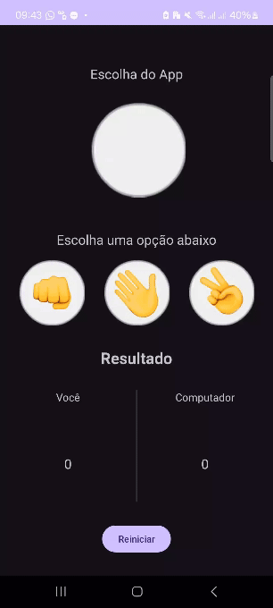

# Pedra, Papel, Tesoura

Este é um aplicativo Android simples de "Pedra, Papel, Tesoura". Os jogadores escolhem entre "pedra", "papel" ou "tesoura" clicando em imagens, e o resultado do jogo é exibido na tela.

## Funcionalidades

- **Escolha de Jogada:** Os jogadores podem selecionar "pedra", "papel" ou "tesoura" clicando nas imagens correspondentes.
- **Resultado:** O resultado do jogo (vitória, derrota ou empate) é exibido após cada jogada.
- **Pontuação:** O placar dos jogadores e do computador é atualizado automaticamente.
- **Reiniciar Jogo:** O jogo pode ser reiniciado, resetando a pontuação e o estado atual.

## Capturas de Tela

